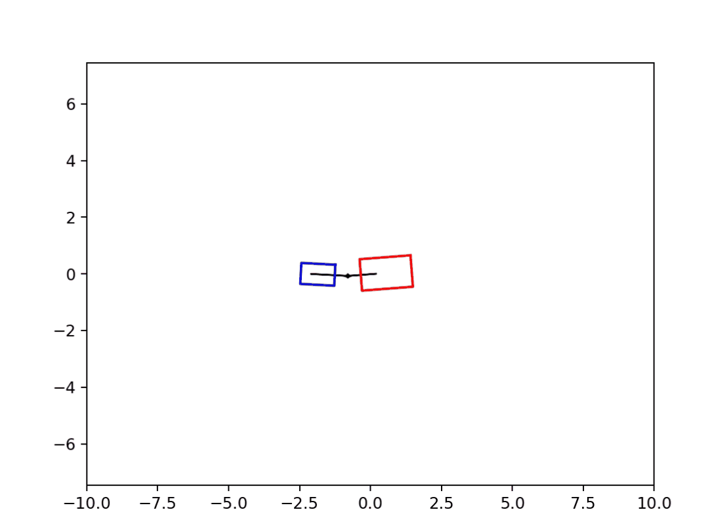
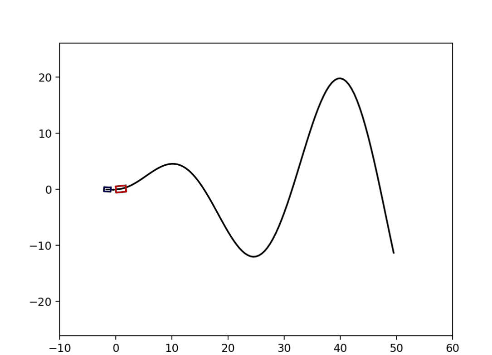

# tractor-trailer kinodynamic sim

---

This is a simple kinodynamic simulation for tractor-trailer system
1. using this model for a circle tracking and drawing its traj. `usage: python3 circle_test.py`

2. base on this model and using pure pursuit to track a path. `usage: python3 pure_pursuit_test.py`

